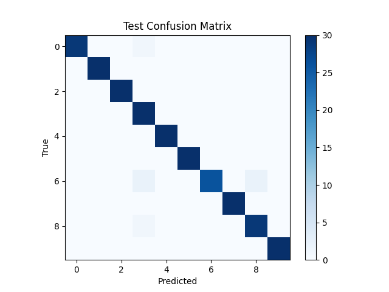

# CWDigitChallenge

## Model Training Philosophy

The idea is to train a model that is both of low latency and high efficacy. Probably for this particular task, a simple 1D CNN on audio waves could have done a good job but it would probably be of greater latency. Furhthermore, many of the speech based tasks are generally done on mel spectrograms or in some cases MFCCs. For simplicity I started off with MFCCs since they are more compressed than mel spectrograms.

### MFCC for spoken digit classifications
MFCCs are extracted with the following parameters:<br>
```
mfcc = librosa.feature.mfcc(
    y = y,
    n_mfcc=self.n_mfcc, #specified by user
    n_fft=256,
    hop_length=80,
    n_mels=40,   
    fmin=20,
    fmax=self.sr//2
)
```
To take into account the  variation audio lengths, a mean is taken across the time domain for each MFCC. This not only makes each sample of the same shape, but also reduces the total number of modelling parameters. Based on these inputs, two models were experimented on as discussed below 

#### Augmentations

To make the model robust to noise and improve efficacy, the following augmentations were added randomly to samples:

1. Gaussian noise addition


#### Logistic Classifier
A simple logistic classifier was trained on the input samples, although it was giving a decent efficacy, the model was underfitting.

#### 1D CNN
A simple 1D CNN that takes MFCC sequences as input, where each coefficient is treated as a channel across time. The network has two convolutional layers with batch normalization and ReLU activations, followed by temporal pooling to reduce the sequence into a fixed-size representation. A dropout layer helps regularize the features before a final fully connected layer outputs class predictions. This is both lightweight and gives a very good efficacy, results discussed below

## Results

**Note:** for brevity, k-fold cross validation and speaker independent evaluation have been skipped. A simple train/val/test split is used.

### Efficacy/Performance:
Overall the CNN model attains a ```97.3% accuracy``` on the test set. <br><br>

<p align="center">
  
</p>

### Latency
the latency is measured over the entire test set sequentially (not in batches) and averaged over the entire set. The tests are done on an ```Intel i5-12400f``` Statitics are as follows
```
Minimum: 0.17 ms
Maximum: 30 ms
Average (over test set): 0.47 ms
Total (for entire test set): 0.141 seconds
```


## How to train/test
create new environment an run:
```pip install -r requirements.txt```

**Train**<br>
Simply run: ```train.py``` and it will train the best model and save it under ```lightning_logs``` dir. This will also contain the best ckpt and tensorboard logs.<br> Example usage for changing params: 

```python train.py --n_features 80 --batch_size 16 --max_epochs 20 --accelerator gpu --devices 1```


**Testing**<br>
run:<br>
```test.py --n_features {mfcc_features} --ckpt_path {path to ckpt}```
if the parameters are not provided, they are set to best defaults. 

## Live Mic Recording (Bonus)
This project provides a lightweight voice activity detection (VAD) recorder that only captures speech segments and automatically trims silence. This is done to keep the recorded audio time close to the dataset distribution. The workflow is:<br>

1. Recording starts as soon as speech is detected and stops when the user finishes speaking.
2. Leading and trailing silence is trimmed, ensuring the output contains only speech.
3. MFCC features are extracted from the audio with a configurable number of coefficients.
4. Model is used for inference

to test the live demo:

run the cells in ```live_demo.ipynb```. The last cell in the notebook can be run repeatedly to repeat the recording and inference. During each recording a wav file ```output.wav``` is saved (and/or overwritten) so the user may inspect the recording

**Note:** If inference fails for a certain recording, try again. Also The **WebRTC VAD** has an `aggressiveness` setting that controls how strictly it filters out non-speech:

- `0` → Very permissive (accepts most sounds as speech, including noise).  
- `1` → Low aggressiveness.  
- `2` → Balanced (good trade-off for most use cases).  
- `3` → Very aggressive (filters out more background noise, but may cut off softer speech).  

You can set it when initializing the recorder:
```python
rec = VADRecorder(aggressiveness=2)  # default = 2
```


## Future Considerations/Improvements

In a more complex scenario, taking the mean over time dimension in MFCCs would not be ideal. Instead, one should consider training a CNN on a melspec/mfcc over time dimension might be suitable as well. Another thing to keep in mind is to set a minimum length to pad all audio waves smaller than this to the specified padding length.<br>

For more robustness some more augmentations can be added, filters, codec distortions etc.


## Important Notice
Please keep in mind that the video submitted alongside is a very raw and form of early development. There are some things that might not seem correct but were done so to get the pipeline up and running. One very obvious example is that during the first training, just to check the pipeline the test set was used as both the val set and the test set.

Usually for my day to day tasks I do pair programming with ChatGPT, there I can discuss, plan and validate ideas alongside getting code snippets. Also, my habit is to write code in small snippets first with GPT and test these snippets as they are integrated/implemented. 

